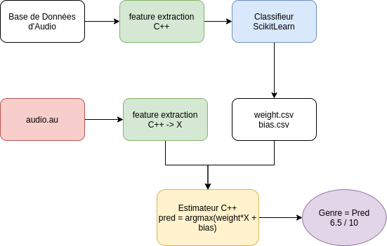

# Reconnaissance de genre musicaux. 

## Introduction
 
 Dans le schema suivant vous trouverez le processus de construction de notre estimateur portable sur un ordinateur embarqué/ 

<figure>
    
</figure>

## :barber: Tracker :barber:
Here is a tracker for each task we have to do.

| Task            |Responsible | Progression      | Note |
| ----------------|:----------:|:----------------:|:----:|
| Classifieur SVM      |Mickael     |:heavy_check_mark:|      |
| Extracteur des Features |Gwendal |:heavy_check_mark:|      |
| Prediction  |Gwenddal      |:heavy_check_mark:|      |


## Extraction des Features

Dans un premier temps, nous avons extrait les paramètres de notre jeu de donnée sur Matlab pour des raisons de simplicité, puisque contrairement en python ou en cpp, quelques lignes de codes suffisent pour le faire sur Matlab.  

Nous avons d’abord utilisé la STFT avec un fenêtrage de Blackman, mais nous nous sommes rendu compte que le nombre de features avec cette méthode était énorme. Pour avoir moins de features, nous nous sommes tournés vers la méthode MFCC. La fonction mfcc est déjà implémenté sur Matlab, elle nous renvoi les coefficients, il nous restait à faire la moyenne et l’écart type de chaque coefficient. Grace à cela, nous sommes passé d’un tableau de 1000 x 28features pour la stft à un tableau de 1000 x 512 features avec la MFCC, cela nous facilitera ta tâche lors de l’entrainement de notre modèle.  

## Extraction des features en C++

### MFCC

Après avoir entrainer notre modèle, nous avons voulu le faire l’extraction des features en cpp avec la MFCC pour faire notre prédiction mais nous avons rencontré des complications. Par manque de temps, nous avons laissé cette option de côté et nous nous tourné vers la STFT 

### STFT
Le code C++ pour extraire les features en STFT a déjà été fourni par le professeur, nous avons donc extrait toutes les features de notre jeu de donnée en C++  pour etre sur d’avoir les mêmes features durant la prédiction. Nous avons donc à nouveau fait l’entrainement mais cette fois-ci juste en SVM avec LinearSVC et ainsi exporter la matrice de poids et de bias en csv  

## Obtention d'un modèle avec SKLearn

Nous avons fait une normalisation avec RobustScaler() pour ne pas éparpiller nos données  

### SVM 

En SVM nous avons utilisé LinearSVC de SKLearn puis une optimisation avec GridSearchCV et nous avons extrait les poids et bias en csv 

60% de réussite au niveau de la prédiction  

### Réseaux de neurone 

Nous l’avons d’abord fait avec SKlearn  en utilisant MLPClassifier : 65% de réussite  

Après discussion avec les encadrants, nous l’avons fait avec keras  


## Installation


Pour générer un fichier CSV contenant les features :

```
mkdir build
cd build 
cmake ..
make 
./extraction
``` 

Pour effectuer l'entrainement et exporter les biais et poids. 
On peut le faire soit dans Colab ou en local :

```
python3 classifieur.py
```

Placer les exports de poids et

Pour faire de la prédiction :

```
mkdir build
cd build 
cmake ..
make 
./predict <music path>
``` 


## Performances


Le SVM nous donne une performance de 60 % ie 6 fois sur 10 la prédiction est bonne. 
Cela est correct. On peut voir notamment sur la matrice de confusion que les résultats ne sont pas homogènes et dépendent de la classe. 
Sur un genre comme le classique nous avons une performance de 100 %, c'est très bon pour le métal aussi. Mais pour des genres musicaux proches 
comme la pop ou le rock,  le SVM a plus de difficultés. 

<figure>
    
</figure>


## Machine Hôte


Le programme predict peut etre compilé sur une RPI contenant les fichiers de poids et de biais du SVM. 


## Auteurs

* Mickael Houssen Ramatola
* Gwendal Priser

## License

This project is licensed under the GNU General Public License v3.0 - see the [LICENSE.md](LICENSE.md) file for details


