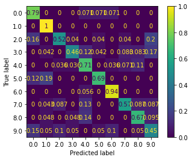

# Reconnaissance de genre musicaux 

## Introduction


## :barber: Tracker :barber:
Here is a tracker for each task we have to do.

| Task            |Responsible | Progression      | Note |
| ----------------|:----------:|:----------------:|:----:|
| Classifieur SVM      |Quentin     |:heavy_check_mark:|      |
| Extracteur des Features |Gwendal |:heavy_check_mark:|      |
| Prediction  |Gwenddal      |:heavy_check_mark:|      |


## Installation


Pour générer un fichier CSV contenant les features :

```
mkdir build
cd build 
cmake ..
make 
./extraction
``` 

Pour effectuer l'entrainement et exporter les 


Pour faire de la prédiction :

```
mkdir build
cd build 
cmake ..
make 
./predict <music path>
``` 


## Performances


Le SVM nous donne une performance de 60 % ie 6 fois sur 10 la prédiction est bonne. 
Cela est correct. On peut voir notamment sur la matrice de confusion que les résultats ne sont pas homogènes et dépendent de la classe. 
Sur un genre comme le classique nous avons une performance de 100 %, c'est très bon pour le métal aussi. Mais pour des genres musicaux proches 
comme la pop ou le rock le SVM a plus de difficultés. 

<figure>
    
</figure>


## Auteurs

* Mickael Houssen Ramatola
* Gwendal Priser

## License

This project is licensed under the GNU General Public License v3.0 - see the [LICENSE.md](LICENSE.md) file for details


